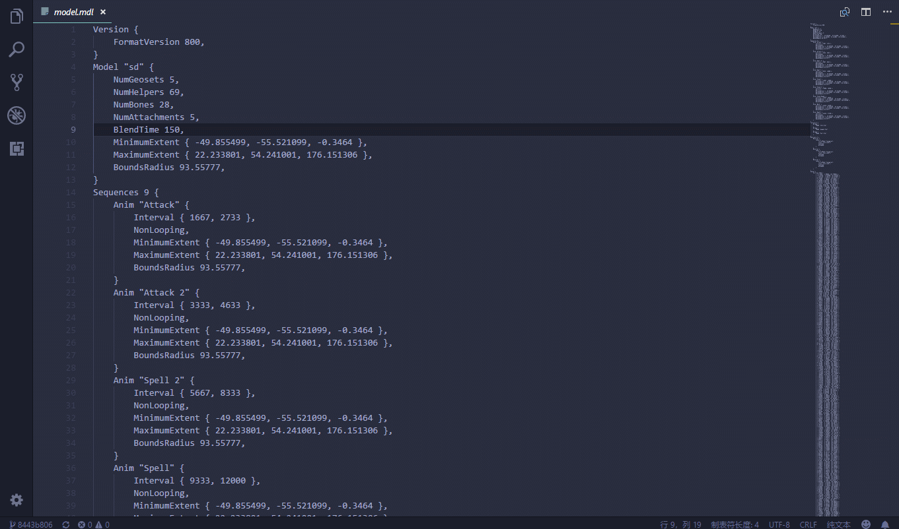

# vscode-preview-mdl

View Warcraft III model file .mdl in vscode.

## Feature

## Thanks

1. [vscode-preview-server](https://github.com/YuichiNukiyama/vscode-preview-server)
1. [war3mdl2json](https://github.com/oxyflour/war3mdl2json)

## How to build locally

1. Ensure that you have `gulp-cli` installed globally using `npm i -g gulp-cli`.
1. Run `npm install` to bring in the dependencies.
1. Run `gulp build` to produce i18n files.
1. Press `F5` key to launch extension.

## Lisence
[MIT](https://github.com/dulingzhi/vscode-preview-mdl/blob/master/LICENSE)
